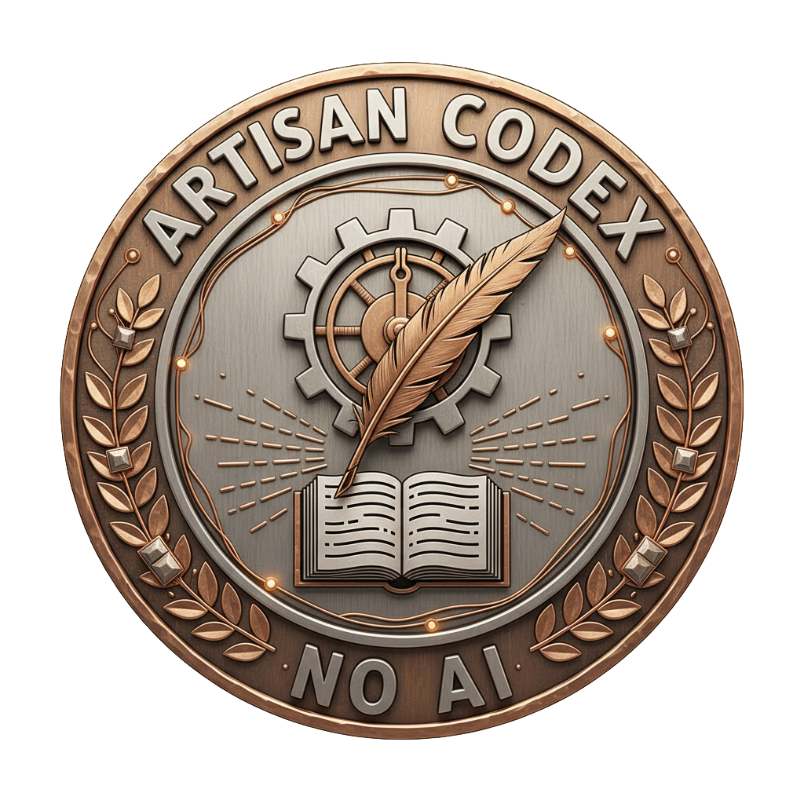

<div align="center">



# CraftCoding

**Monitor your coding sessions. Prove every line is yours.**

[](https://www.python.org/)
[](https://www.microsoft.com/windows)
[](LICENSE)
[](https://github.com)

*Yes, this anti-AI tool was built with AI. The irony is very much intentional.*

</div>

---

## What is CraftCoding?

CraftCoding is a desktop application that runs silently while you code. It watches your windows, browser tabs, and running processes every second. The moment it spots an AI tool — ChatGPT, Cursor, Copilot, or anything else — it fires an alert, docks your score, and in Strict Mode redirects you.

When you finish a project you get a **certificate PNG** with your stats and one of three seals:
 
- 🥇 **Artisan Coder** — 0 detections, score ≥ 90%
- 🥈 **Hybrid Coder** — used hints or had some detections
- ❌ **Vibe Coder** — score below 50%

</div>

---

## Why does this exist?

During my second year of cross-platform application development studies, I started noticing a worrying pattern: students were handing their problem-solving over to AI entirely — often without understanding what came back.

AI is a powerful tool. The issue is **unconscious dependency**. CraftCoding makes the choice deliberate. You can still ask for help — it just costs you points and downgrades your seal.

> *The certificate is not a judgment. It is a record.*

---

## Features

- **Project sealing**: name your project, seal it, and the timer only runs while you're actively coding
- **Live timer**: pauses and resumes, everything saves automatically to a local SQLite database
- **4-layer AI detection**: window titles, browser process arguments, running executables (Cursor, Copilot, Tabnine…), and live Edge/Chrome session files
- **Two modes**: Friendly (warnings only) or Strict (closes the AI tab and redirects to Stack Overflow)
- **Human Score**: starts at 100%, −5 per detection, −10 for using the emergency hint
- **Emergency mode**: if you're completely stuck you can request a hint, but it downgrades your seal
- **Certificate export**: generates a styled PNG with your medal image, stats, and a unique ID
- **Project library**: manage all your past projects, filter by status, reopen or delete them

---

## Installation

### Prerequisites

- Python **3.10 or higher**
- Windows 10 / 11 *(detection layers 2–4 are Windows-specific)*

### 1 — Clone the repo

```bash
git clone https://github.com/yourusername/craftcoding.git
cd craftcoding
```

### 2 — Install dependencies

```bash
pip install customtkinter pygetwindow pyautogui psutil Pillow
```

<details>
<summary>Optional: Firefox session detection</summary>

```bash
pip install lz4
```
</details>

### 3 — Add your medal images

Place the three medal PNGs in an `img/` folder next to the script:

```
craftcoding/
├── craftcoding.py
├── craftcoding.db        ← created automatically on first run
└── img/
    ├── artisancoder.png
    ├── hybridprogramer.png
    └── vibecoder.png
```

### 4 — Run

```bash
python craftcoding.py
```

---

## How to use it

```
1. Type your project name  ──▶  Press Enter or click SELLAR
                                        │
2. Choose your mode  ────────────────▶  Amable (warnings) or Estricto (closes tabs)
                                        │
3. Click ▶ INICIAR FORJA  ────────────▶  Timer starts. CraftCoding watches.
                                        │
4. Code.                                │
                                        │
5. Click ⏸ PAUSAR  ─────────────────▶  Progress saves automatically.
                                        │
6. Click 🏆 CERTIFICAR  ─────────────▶  Get your seal. Export your certificate.
```

> Your project library is always accessible from the sidebar with **📂 Mis Proyectos**.
> You can close and reopen the app at any time — everything is saved.

---

## Detection accuracy

| Scenario | Result |
|----------|--------|
| ChatGPT open with a renamed chat title | ✅ Detected — window title scan |
| Claude in an Edge tab in the background | ✅ Detected — session file scan |
| Cursor IDE running | ✅ Detected — process scan |
| GitHub Copilot active in VS Code | ✅ Detected — process scan |
| ChatGPT visited 20 min ago, tab now closed | ✅ Not detected — history scan intentionally removed |
| Edge closed, old session file on disk | ✅ Not detected — 5-minute freshness check |
| Ollama running locally | ✅ Detected — process scan |

---

## Project structure

```
craftcoding.py        Entry point and full application
craftcoding.db        SQLite database (auto-created, auto-migrated)
img/                  Medal images used in certificate generation
```

The database stores: project name · total seconds · Human Score · AI detection count · status · start/end dates · seal type.
Schema migrations run automatically — old databases update without data loss.

---

## Tech stack

| Library | Role |
|---------|------|
| [CustomTkinter](https://github.com/TomSchimansky/CustomTkinter) | Modern dark-mode desktop UI |
| [psutil](https://github.com/giampaolo/psutil) | Process monitoring |
| [PyGetWindow](https://github.com/asweigart/pygetwindow) | Window title scanning |
| [PyAutoGUI](https://github.com/asweigart/pyautogui) | Tab redirection in Strict mode |
| [Pillow](https://python-pillow.org/) | Certificate PNG generation |
| SQLite3 | Local project database (stdlib) |

---

<div align="center">

**CraftCoding** — because the best code is the code you actually understand.

</div>
